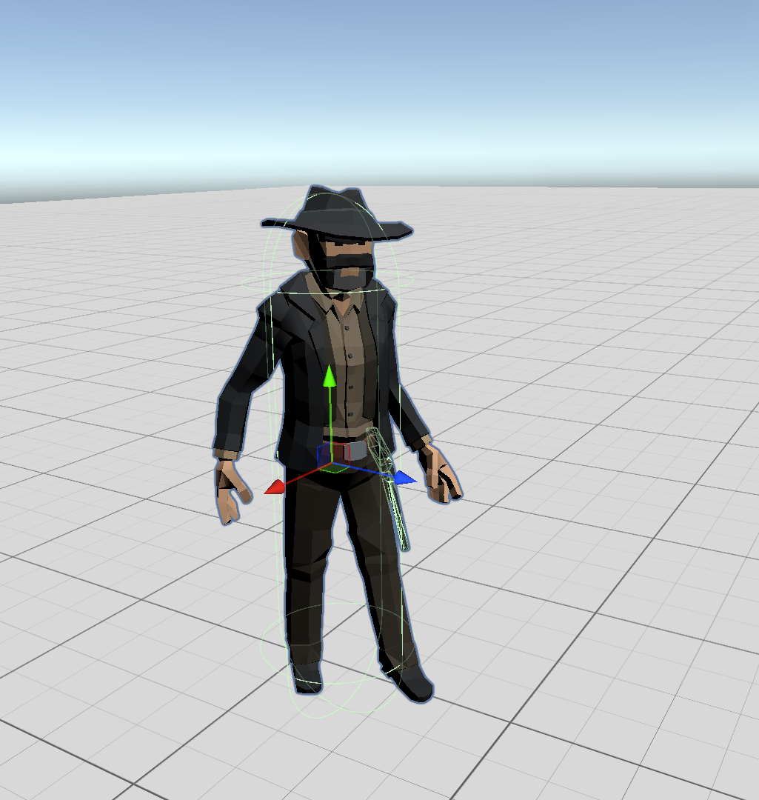
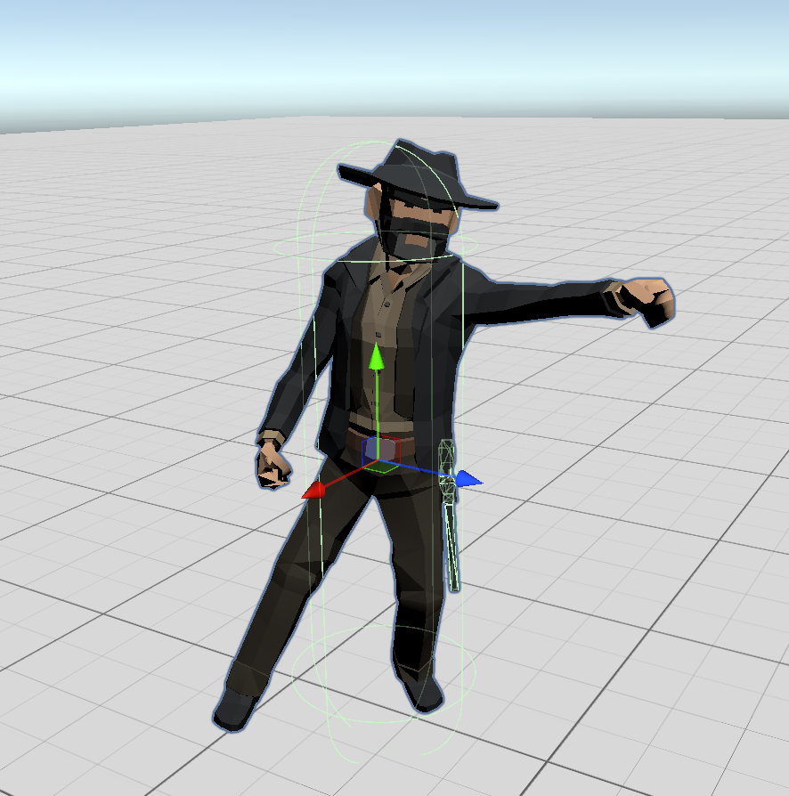
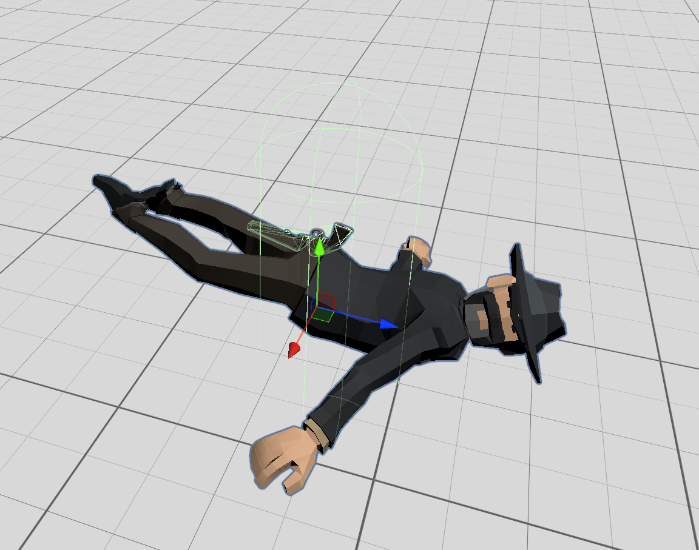
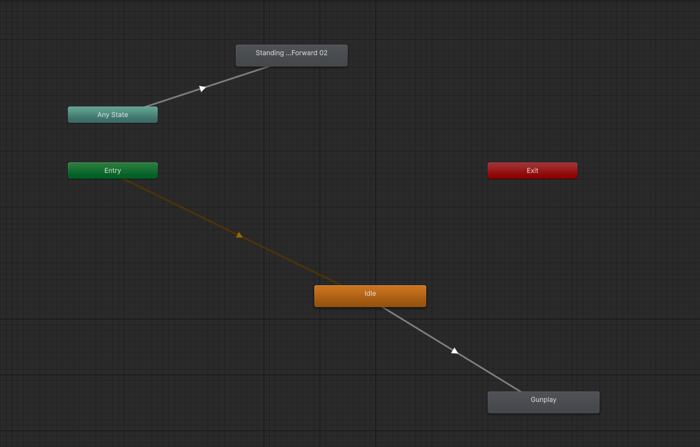
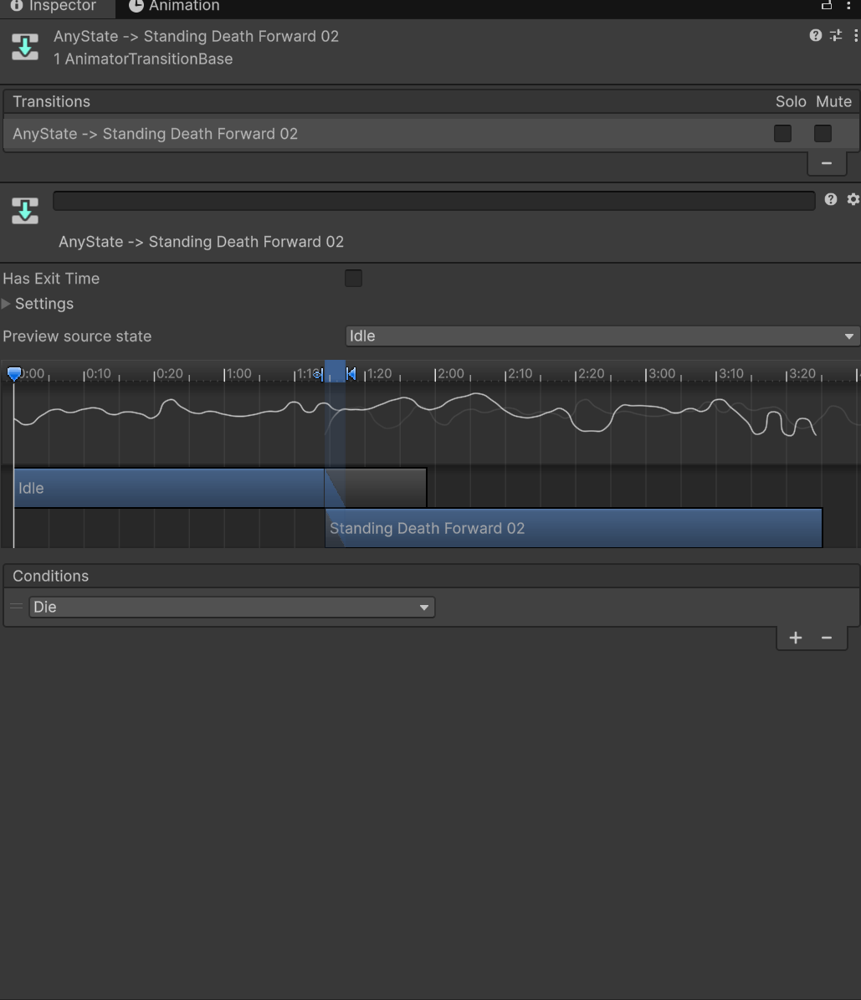
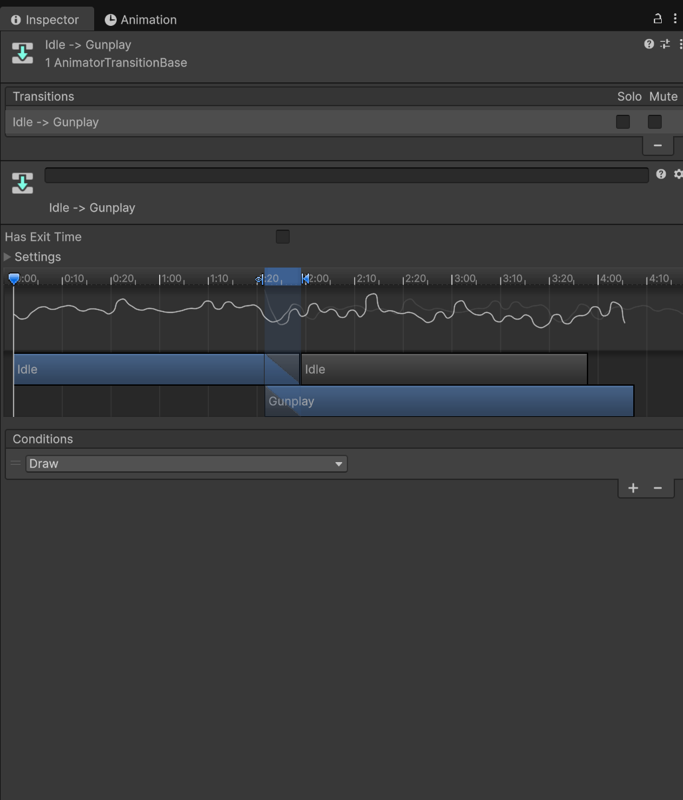
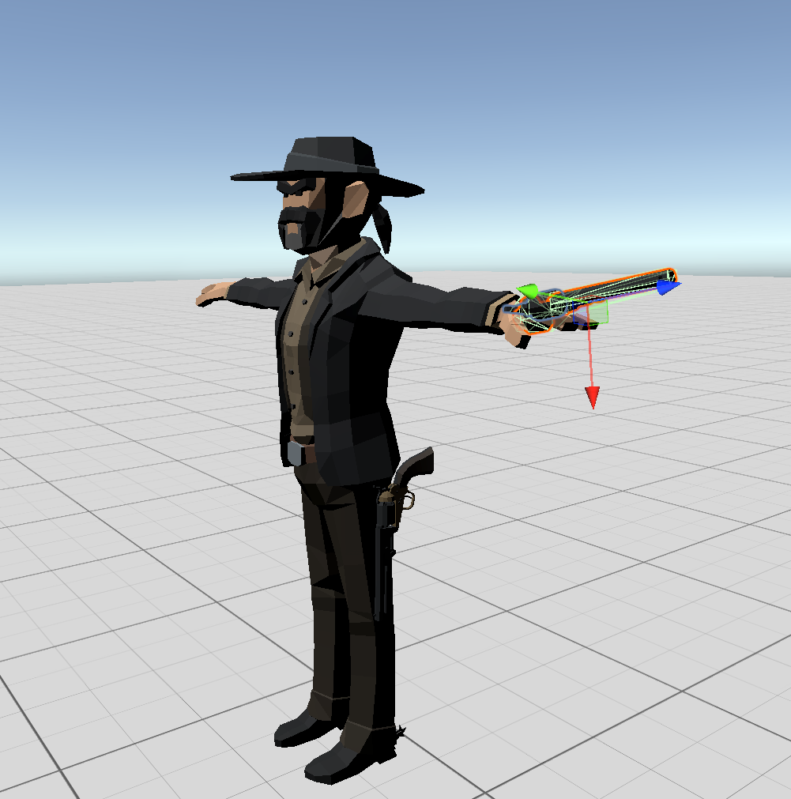
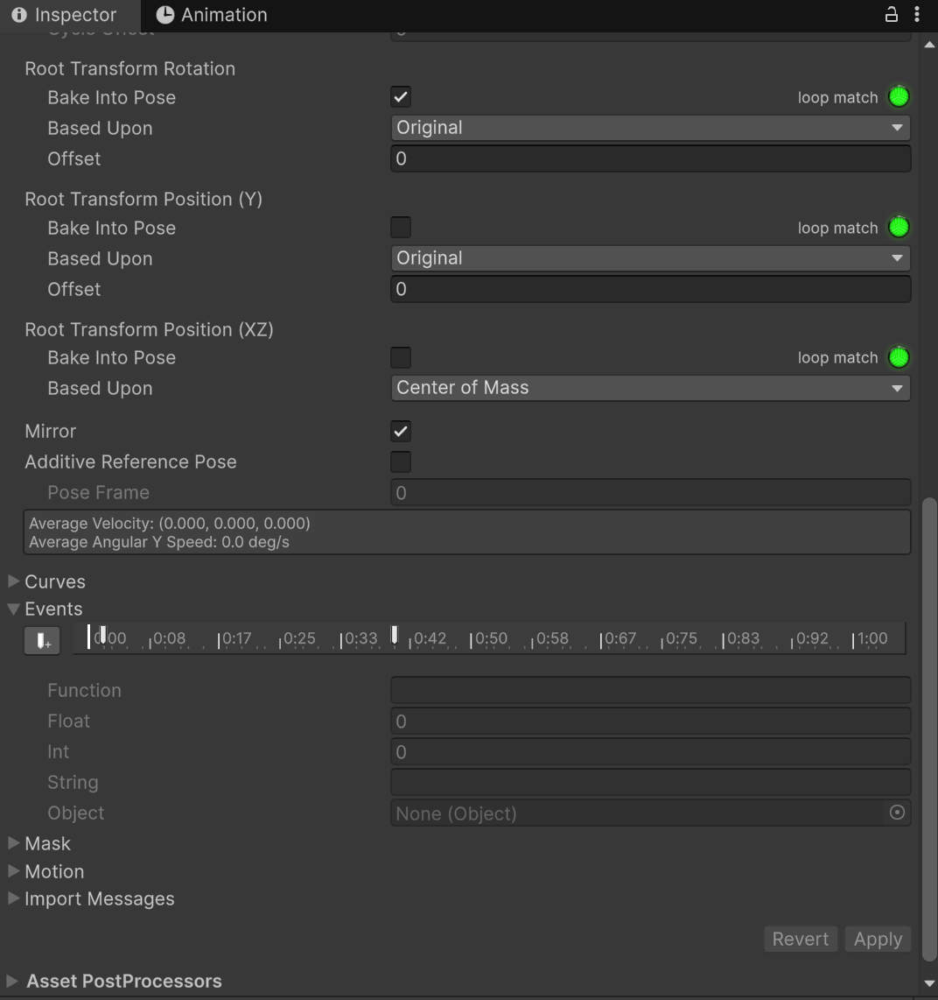

# Week 6 – VR Quickdraw Simulator: Duel System, Enemy AI & Animation Setup

## Overview
This week, I shifted my focus from the gun mechanics to implementing the **duel system** and adding an animated enemy to fight against. The goal was to make the game feel more like an actual quickdraw battle which consisted timing, pressure,etc. and also an opponent that reacts to the player.

The key takeaways were:
- A full **DuelManager** that controls the game loop
- An animated western enemy
- A system that makes the enemy **look at the player**
- A gun–swapping system so the enemy actually draws a weapon
- Animation events for syncing visuals and sound

This made the game flow like: *wait… draw… shoot… win or lose.*

---

## Implementing the Duel System

I started by creating an empty GameObject and attaching my **DuelManager** script to it. This object controls the flow of the duel: when the enemy attacks, when the player is allowed to draw, and what counts as a foul.


### Key Settings
- **Min / Max Wait Time:** How long the game waits before yelling “DRAW!”
- **Enemy Draw Time:** How fast the enemy shoots you
- **Fight Sound:** Plays at the exact moment the duel begins
- **Lose Sound:** Plays if the player fouls or is too slow

---

### Duel Flow (Coroutine Breakdown)
At the start of the scene, the DuelManager begins the duel with a coroutine:

```csharp
StartCoroutine(DuelRoutine());
```

---

### 1. Setup Phase
Reset flags, UI and enemy.
```csharp
gameIsOver = false;
isWaiting = true;

enemyAnimator.ResetTrigger("Draw");
enemyAnimator.ResetTrigger("Die");
enemyVisuals.ResetToHolster();
```
---
### 2. Waiting Phase

The duel starts with a random wait time. If the player grabs the gun here, it counts as a foul.

```csharp
float waitTime = Random.Range(minWaitTime, maxWaitTime);
yield return new WaitForSeconds(waitTime);
```

If the player grabs early, he loses:

```csharp
if (isWaiting)
{
    PlayerLoses("Foul! Too early!");
}
```
---
### 3. DRAW Phase

```csharp
isWaiting = false;
audioSource.PlayOneShot(bellSound);
enemyAnimator.SetTrigger("Draw");
```
* Bell sound plays.
* Enemy begins draw animation.
* Player is now allowed to grab the gun.
---

### 4. Enemy Shot Timer
If the player fails to shoot fast enough, the enemy "shoots" back.
```csharp
yield return new WaitForSeconds(enemyDrawTime);
if (!gameIsOver) PlayerLoses("Too slow!");
```
This creates the tension of a quickdraw.

---

### 5. PlayerWins Logic

```csharp
public void PlayerWins()
{
    if (gameIsOver) return;

    gameIsOver = true;
    StopCoroutine("EnemyShotTimer");

    enemyAnimator.SetTrigger("Die");

    StartCoroutine(ResetDuel("You win! Next round..."));
}
```

* Stop the enemy from shooting after death
* Play the death animation
* Begin resetting the round (for testing)

---

## Adding the Enemy Character

I imported a western environment pack for the asset store, and one of the cowboy characters already came with an avatar. This made animation much easier because Unity automatically mapped all the bones.


I downloaded 3 Mixamo animations (without skin):
- **Idle** (enemy waiting silently)
- **Gunplay** (enemy drawing and firing) 
- **Standing Death** (enemy falling after being shot) 

---

## Setting Up the Animator

I created an Animator Controller for the enemy and drag and dropped the three animations into it.
Transitions:
- `Idle → Gunplay` (trigger: `Draw`)
- `Any State → Death` (trigger: `Die`)






These triggers are then called in the DuelManager at the appropriate times.
```csharp
    IEnumerator DuelRoutine()
    {
        // 1. Setup Phase
        gameIsOver = false;
        isWaiting = true;

        if (dontGrabText != null) dontGrabText.SetActive(true);

        // Reset Enemy
        if (enemyAnimator != null)
        {
            enemyAnimator.gameObject.SetActive(true);
            enemyAnimator.ResetTrigger("Draw");
            enemyAnimator.ResetTrigger("Die");
        }
        if (enemyVisuals != null) enemyVisuals.ResetToHolster();

        // 2. Wait Phase
        float waitTime = Random.Range(minWaitTime, maxWaitTime);
        yield return new WaitForSeconds(waitTime);

        // 3. DRAW Phase
        isWaiting = false; // Gun is now live!

        if (dontGrabText != null) dontGrabText.SetActive(false);
        if (shootText != null) shootText.SetActive(true);

        // Mark the time RIGHT NOW
        drawStartTime = Time.time;

        if (bellSound != null) audioSource.PlayOneShot(bellSound);

        // Enemy Reaction Delay
        float reactionDelay = Random.Range(0.2f, 0.5f);
        yield return new WaitForSeconds(reactionDelay);

        if (enemyAnimator != null) enemyAnimator.SetTrigger("Draw"); //Draw animation called here

        // Start Enemy Kill Timer
        StartCoroutine(EnemyShotTimer());
    }

    IEnumerator EnemyShotTimer()
    {
        yield return new WaitForSeconds(enemyDrawTime);
        if (!gameIsOver)
        {
            PlayerLoses("Too slow! You died.");
        }
    }
```
```csharp
public void PlayerWins()
    {
        if (gameIsOver) return;

        gameIsOver = true;
        Debug.Log("--- YOU WIN! ---");

        // Stop the enemy from shooting you
        StopCoroutine("EnemyShotTimer");
        
        // Play the death animation
        if (enemyAnimator != null)
        {
            enemyAnimator.SetTrigger("Die"); // Death animation called here
        }

        // Start a new duel after a delay
        StartCoroutine(ResetDuel("You win! Next round..."));
    }
```


---

## Making the Enemy Look at the Player

I noticed the enemy wasn’t aiming/looking at the player but rather straight ahead from its initial spawn position. To fix this, I wrote a simple script called **EnemyLookAtPlayer**:

```csharp
public class EnemyLookAtPlayer : MonoBehaviour
{
    public Transform playerCamera;

    void Update()
    {
        if (playerCamera != null)
        {
            Vector3 targetPosition = playerCamera.position;
            targetPosition.y = transform.position.y;
            transform.LookAt(targetPosition);
        }
    }
}
```

By locking the `y` value to the enemy’s height, I prevent the character from tilting up and down and keep the rotation strictly horizontal. I then assigned the VR main camera as `playerCamera`, so the enemy always aims at the player.

---

## Making the Enemy Draw a Gun

After I setup the looking logic and the duel flow, the enemy was indeed looking at the player and playing the shoot animation, but there was no gun in his hand, which made it look unrealistic
My initial opinion was to just have a gun attached to his hand transform, but then the gun was in his hand at all times, which broke the game rules.
To fix this, I attached:
- One gun GameObject to his **hip**
- One gun GameObject to his **hand**
- 


Then I wrote the **EnemyVisuals** script:

```csharp
public class EnemyVisuals : MonoBehaviour
{
    public GameObject holsterGun;
    public GameObject handGun;

    public AudioClip shootSound;
    private AudioSource audioSource;

    void Start()
    {
        audioSource = GetComponent<AudioSource>();
        if (audioSource == null)
            audioSource = gameObject.AddComponent<AudioSource>();
    }

    public void SwapToHandGun()
    {
        holsterGun.SetActive(false);
        handGun.SetActive(true);
    }

    public void PlayShootSound()
    {
        audioSource.PlayOneShot(shootSound);
    }

    public void ResetToHolster()
    {
        holsterGun.SetActive(true);
        handGun.SetActive(false);
    }
}
```

* Before runtime, the holster gun is active and the hand gun is inactive.
* When the enemy draws, the `SwapToHandGun()` method is called to switch the guns.
* When the enemy shoots, the `PlayShootSound()` method is called to play the gunshot sound.

I then added **animation events** to the gunplay animation import settings at the exact frames where the gun should swap and when the enemy should shoot.


---

## Results

By the end of this week, I now have:

- A fully functional duel system
- Randomized wait time before “DRAW!”
- Early grabbing counts as a foul
- Enemy draws and “shoots” the player
- Player needs to shoot the enemy first to win
- Enemy plays idle, draw, and death animations
- Gun-swap animation with audio
- Enemy always looks at the player

The game finally feels like a proper quickdraw instead of just a shooting demo.

---

## Reflection

This week, my progress was quite noticeable and the game feels more alive. I did notice a small issue where the enemy's drawing the gun too fast regardless of the wait time. I will fix it next week.

