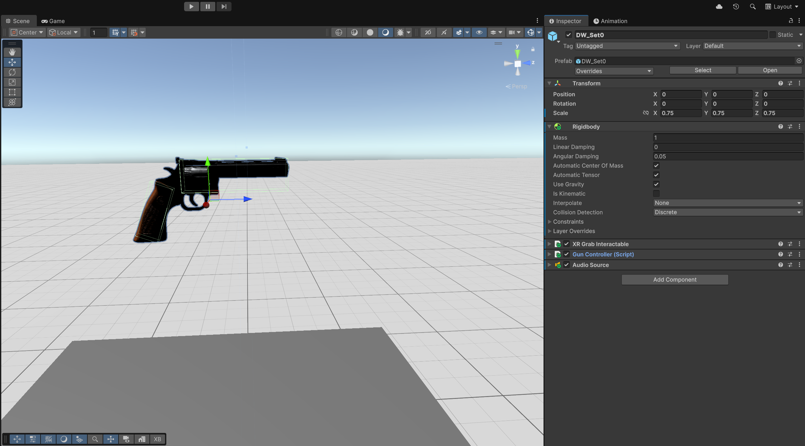
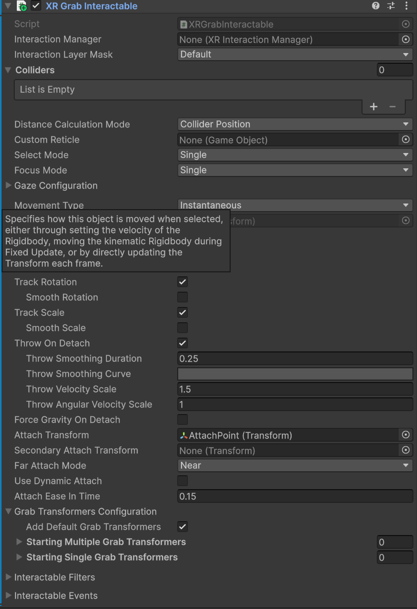
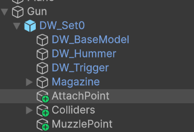
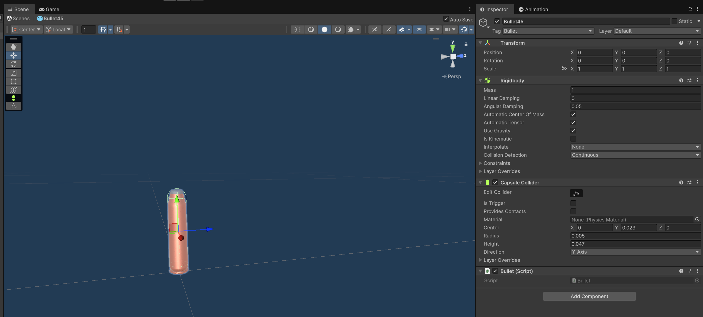
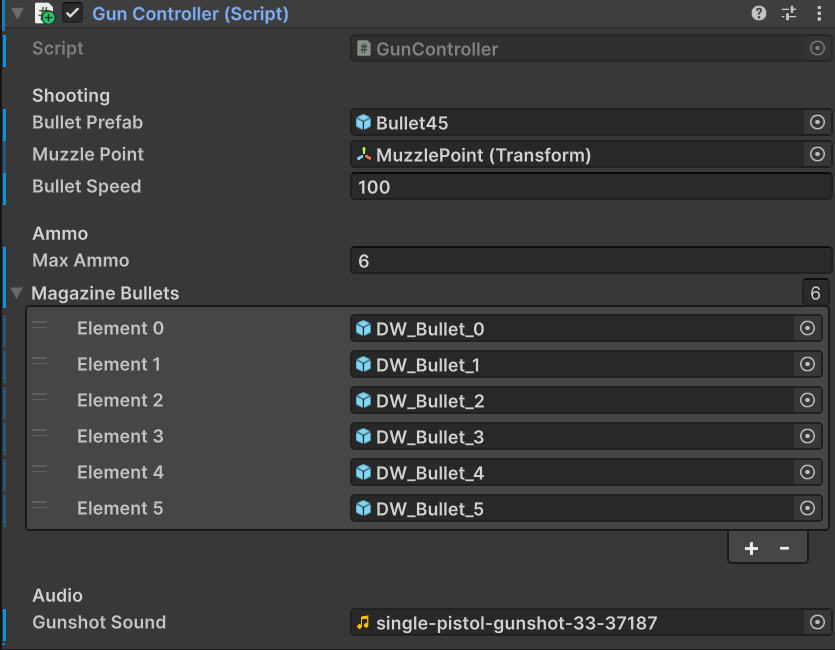
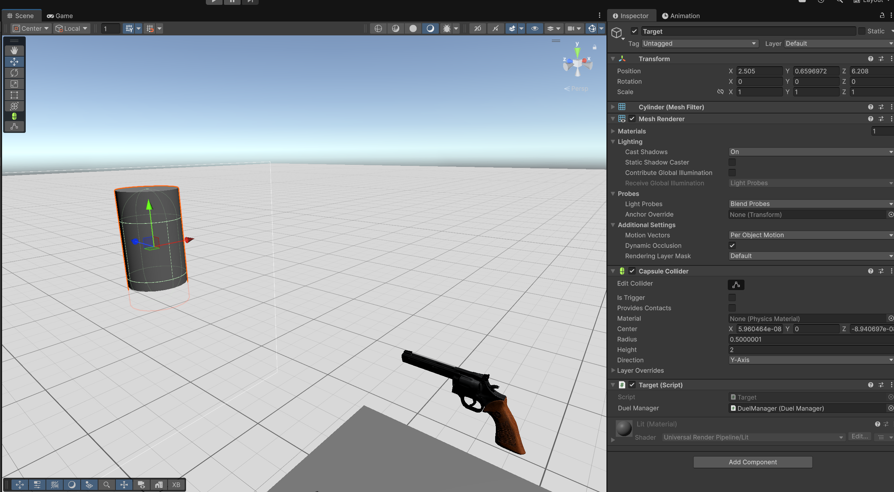

# Week 5 – VR Quickdraw Simulator: Gun Grabbing, Shooting & Basic Target System

## Overview
This week, I began working on the second application for the course, which is a **VR Quickdraw Simulator**. My goal was to lay down the foundation of the core mechanics ready. So basically getting the gun into the scene, making it grabbable, implementing shooting, and creating a simple target to test everything. This was my first week shifting from the AR to VR, so most of the focus was on getting used to the basics of Unity's VR system.

## Setting Up the Gun Model
I started by importing the revolver asset I found in the Unity Asset Store.

To make the gun interact naturally in VR, I added:

- A **Rigidbody**
- A set of **colliders** around the gun

This allowed the gun to fall onto the cube at runtime, which is useful for testing until I build a holster.

## Making the Gun Grabbable
To allow the player to pick up the revolver, I added the **XR Grab Interactable** component.  
The gun initially snapped into the hand at an awkward angle, so I created an empty object called **AttachPoint**, positioned exactly where the hand should hold the weapon. Assigning this to the *Attach Transform* gave me a much more natural grip.

### Movement Type: Instantaneous
I tested the other modes (Kinematic, Velocity Tracking,etc.), but **Instantaneous** simply gave the cleanest result. It snaps the gun into the correct position immediately, which feels right for a quickdraw-style weapon.

 

---

## Setting Up the Bullets
The model already came with six visible bullets inside the cylinder.

For the actual fired projectiles, I created and used a prefab called **Bullet45**, which contains:

- A Rigidbody
- A CapsuleCollider
- A "bullet" tag
- And this script:

```csharp
public class Bullet : MonoBehaviour
{
    void Start()
    {
        Destroy(gameObject, 5f);
    }
}
```

This ensures the bullets clean themselves up automatically after being fired, so the scene doesn’t fill up with unused objects during testing.



## GunController Script – Shooting Logic
The main logic for the gun is inside the **GunController** script.

Here, we: 

- Listen for the XR trigger pull ( which is the `activated` event)
- Then instantiate a bullet prefab at the muzzle point
- Add some force to give it speed while firing
- Playing a gunshot sound
- Hide the bullet meshes inside the cylinder as ammo decreases

The full script looks like this:

```csharp
using UnityEngine;
using UnityEngine.XR.Interaction.Toolkit;
using UnityEngine.XR.Interaction.Toolkit.Interactables; // For XRGrabInteractable

public class GunController : MonoBehaviour
{
    [Header("Shooting")]
    public GameObject bulletPrefab; // The 'Bullet45' prefab
    public Transform muzzlePoint;     // The empty "MuzzlePoint" object at the barrel tip
    public float bulletSpeed = 50f;

    [Header("Ammo")]
    public int maxAmmo = 6;
    // Assign your 6 'DW_Bullet_X' objects from the Hierarchy
    public GameObject[] magazineBullets;

    [Header("Audio")]
    public AudioClip gunshotSound;
    private AudioSource audioSource;

    private int currentAmmo;
    private XRGrabInteractable grabInteractable;

    void Start()
    {
        // Get the components on this same GameObject
        grabInteractable = GetComponent<XRGrabInteractable>();
        audioSource = GetComponent<AudioSource>(); // Get the AudioSource

        // Add a listener to the "activated" event (this is the trigger pull)
        grabInteractable.activated.AddListener(Shoot);

        // Load the gun
        Reload();
    }

    // Clean up the listener when the object is destroyed
    void OnDestroy()
    {
        if (grabInteractable != null)
        {
            grabInteractable.activated.RemoveListener(Shoot);
        }
    }

    // This function is called when the trigger is pulled
    public void Shoot(ActivateEventArgs args)
    {
        // Check if we have ammo
        if (currentAmmo > 0)
        {
            // --- 1. Decrement Ammo ---
            currentAmmo--;

            // --- 2. Play Sound ---
            if (gunshotSound != null)
            {
                audioSource.PlayOneShot(gunshotSound);
            }

            // --- 3. Fire the Bullet ---
            GameObject bullet = Instantiate(bulletPrefab, muzzlePoint.position, muzzlePoint.rotation);
            Rigidbody rb = bullet.GetComponent<Rigidbody>();

            // Add force along the bullet's 'up' (Y) direction
            rb.AddForce(bullet.transform.up * bulletSpeed, ForceMode.Impulse);

            // --- 4. Update Visuals ---
            // Hide the corresponding bullet in the magazine
            if (magazineBullets.Length > currentAmmo)
            {
                magazineBullets[currentAmmo].SetActive(false);
            }
        }
        else
        {
            // (This is where we'll add an 'empty click' sound maybe later)
        }
    }

    // A simple reload function to reset ammo
    public void Reload()
    {
        currentAmmo = maxAmmo;
        // Show all the bullet models in the magazine
        foreach (GameObject bulletModel in magazineBullets)
        {
            if (bulletModel != null)
            {
                bulletModel.SetActive(true);
            }
        }
    }
}
```

---
## Creating a Simple Target
To test all of this, I created a very simple target by dropping a cylinder into the scene and attaching this script.

```csharp
public class Target : MonoBehaviour
{
    void OnCollisionEnter(Collision collision)
    {
        if (collision.gameObject.CompareTag("Bullet"))
        {
            Destroy(collision.gameObject);
            gameObject.SetActive(false);
        }
    }
}
```


Currently, when hit by a bullet, the target disappears.

## Results
By the end of this week, I now have:

- A grabbable revolver
- Bullet firing with proper muzzle direction
- Working projectile physics
- A basic hit-reactive target

This establishes the initial shooting mechanics that I was aiming for. It already feels pretty fun to simply pick up the gun and fire it.

## Reflection
This week was mainly about getting the core **"shooting"** aspect done. The GunController ended up being the most important part of the week, tying input, visuals, and physics together. Next week, I'm hoping to add some "dueling" system and also maybe give the enemy some more life.
